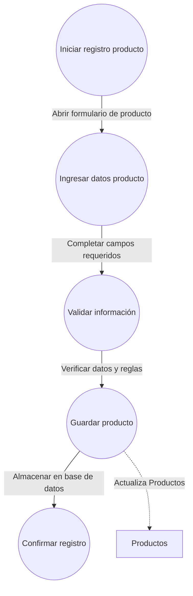
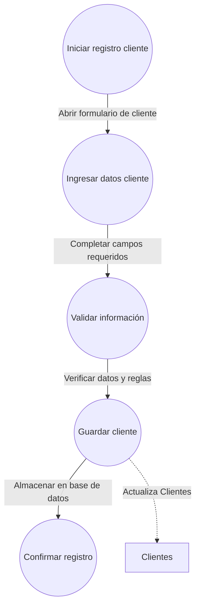
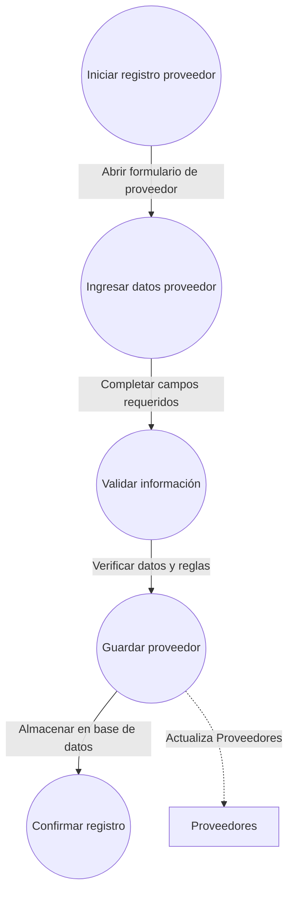
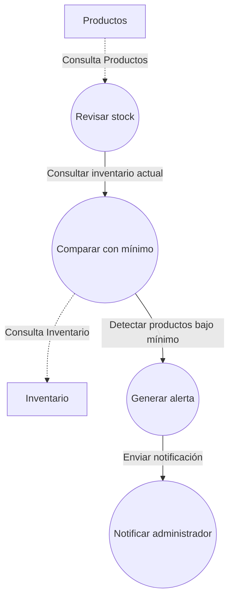

# Nivel 3 - Diagrama de eventos AdminLibreria

## 1. Registrar productos de venta


## 2. Registrar clientes frecuentes


## 3. Registrar proveedores


## 4. Generar alertas por stock mínimo


## 5. Registrar ventas al mostrador
```mermaid
flowchart TD
    clientesD[Clientes]
    productosD[Productos]
    inventarioD[Inventario]
    iniciar5((Iniciar venta)) -- "Abrir módulo de ventas" --> seleccionarC5((Seleccionar cliente))
    seleccionarC5 -- "Elegir cliente de la lista" --> agregarP5((Agregar productos))
    agregarP5 -- "Añadir productos al carrito" --> calcularT5((Calcular total))
    calcularT5 -- "Sumar precios y descuentos" --> actualizarI5((Actualizar inventario))
    calcularT5 -- "Sumar precios y descuentos" --> generarT5((Generar recibo))
    actualizarI5 -- "Actualiza Inventario" -.-> inventarioD
    agregarP5 -. "Consulta Clientes" .-> clientesD
    agregarP5 -. "Consulta Productos" .-> productosD
    calcularT5 -. "Consulta Productos" .-> productosD
    generarT5 -- "Crear recibo de venta" --> procesarP5((Procesar pago))
```

## 6. Registrar devoluciones de productos
```mermaid
flowchart TD
    productosD[Productos]
    inventarioD[Inventario]
    iniciar6((Iniciar devolución)) -- "Abrir módulo de devoluciones" --> seleccionarPD6((Seleccionar producto))
    seleccionarPD6 -- "Elegir producto devuelto" --> ingresarMD6((Ingresar motivo))
    ingresarMD6 -- "Registrar motivo de devolución" --> actualizarID6((Actualizar inventario))
    seleccionarPD6 -- "Consulta Productos" -.-> productosD
    actualizarID6 -- "Actualiza Inventario" -.-> inventarioD
```

## 7. Actualizar inventario por compras y movimientos
```mermaid
flowchart TD
    productosD[Productos]
    inventarioD[Inventario]
    iniciar7((Iniciar actualización)) -- "Abrir módulo de inventario" --> seleccionarPC7((Seleccionar productos))
    seleccionarPC7 -- "Elegir productos comprados/movidos" --> ingresarDC7((Ingresar datos compra/movimiento))
    seleccionarPC7 -- "Consulta Productos" -.-> productosD
    ingresarDC7 -- "Actualiza Inventario" -.-> inventarioD
    actualizarIC7 -- "Confirmar actualización" --> confirmarAC7((Confirmar actualización))
```

## 8. Gestionar promociones comerciales
```mermaid
flowchart TD
    productosD[Productos]
    iniciar8((Iniciar gestión promoción)) -- "Abrir módulo de promociones" --> ingresarDP8((Ingresar datos promoción))
    ingresarDP8 -- "Completar datos de promoción" --> asignarP8((Asignar productos))
    asignarP8 -- "Actualiza Productos" -.-> productosD
    activarP8 -- "Habilitar promoción en sistema" --> confirmarPR8((Confirmar gestión))
```

## 9. Consultar historial de compras de cliente
```mermaid
flowchart TD
    clientesD[Clientes]
    buscarC9 -- "Consulta Clientes" -.-> clientesD
    consultarH9 -- "Obtener compras realizadas" --> mostrarH9((Mostrar historial))
```

## 10. Gestionar pedidos a proveedores
```mermaid
flowchart TD
    proveedoresD[Proveedores]
    iniciarPP10((Iniciar pedido)) -- "Abrir módulo de pedidos" --> seleccionarPV10((Seleccionar proveedor))
    seleccionarPV10 -- "Consulta Proveedores" -.-> proveedoresD
    ingresarDPV10 -- "Completar detalles del pedido" --> enviarPP10((Enviar pedido))
    enviarPP10 -- "Enviar solicitud al proveedor" --> confirmarPP10((Confirmar gestión))
```

## 11. Emitir recibos de venta
```mermaid
flowchart TD
    ventasD[Ventas]
    generarR11((Generar recibo)) -- "Crear recibo de venta" --> mostrarR11((Entregar recibo))
    generarR11 -- "Actualiza Ventas" -.-> ventasD
```

## 12. Visualizar estadísticas generales en el Dashboard
```mermaid
flowchart TD
    dashboardD[Dashboard]
    consultarE12((Consultar estadísticas)) -- "Obtener métricas del sistema" --> mostrarE12((Mostrar en dashboard))
    consultarE12 -- "Consulta Dashboard" -.-> dashboardD
```

## 13. Buscar y filtrar en listados
```mermaid
flowchart TD
    listadosD[Listados]
    ingresarB13((Ingresar criterio búsqueda)) -- "Escribir texto o seleccionar filtro" --> filtrarL13((Filtrar listado))
    filtrarL13 -- "Aplicar filtro a la lista" --> mostrarL13((Mostrar resultados))
    filtrarL13 -- "Consulta Listados" -.-> listadosD
```

## 14. Relacionar productos con proveedores
```mermaid
flowchart TD
    productosD[Productos]
    proveedoresD[Proveedores]
    seleccionarP14((Seleccionar producto)) -- "Elegir producto" --> seleccionarPV14((Seleccionar proveedor))
    seleccionarP14 -- "Consulta Productos" -.-> productosD
    seleccionarPV14 -- "Elegir proveedor" --> guardarR14((Guardar relación))
    seleccionarPV14 -- "Consulta Proveedores" -.-> proveedoresD
    guardarR14 -- "Registrar relación en sistema" --> confirmarR14((Confirmar relación))
```

## 15. Validar formularios y mostrar mensajes de error
```mermaid
flowchart TD
    formulariosD[Formularios]
    ingresarF15((Ingresar datos en formulario)) -- "Completar campos" --> validarF15((Validar datos))
    ingresarF15 -- "Consulta Formularios" -.-> formulariosD
    validarF15 -- "Verificar reglas y formato" --> mostrarM15((Mostrar mensaje de error))
    mostrarM15 -- "Mostrar mensaje en pantalla" --> corregirF15((Corregir datos))
```
